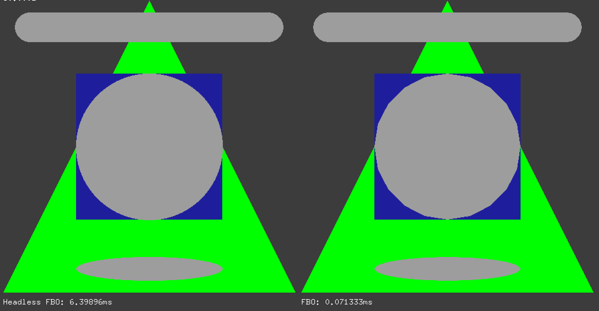

# ofxHeadlessFbo



## Introduction

This is a simple addon implimenting the basic 2D drawing functions that don't
utilize OpenGL. Inspired from the [Adafruit GFX Library](https://github.com/adafruit/Adafruit-GFX-Library).
The shapes are drawn directly to an buffer of `ofPixels` instead of `ofTextures`.

This addon is intended to be used in applications that run headless,
for example a Rasberry Pi controlling LED strips without a monitor connected
(thus unable to run OpenGL).

I hope you find this useful.
Please open an issue if you have suggestions or find bugs, and feel free to
contribute improvements.

## Installation

Download the addon into your `openframeworks/addons/` directory or
install using git:
`git clone https://github.com/ghztomash/ofxHeadlessFbo.git`

## Use

Before drawing into the buffer you need to first allocate it's size and
define the pixel color type.

```c++
ofxHeadlessFbo hfbo;

void ofApp::setup(){
    // allocate virtual FBO buffer
    hfbo.allocate(800, 300, OF_PIXELS_RGBA);
}

void ofApp::update(){
    hfbo.clear(ofColor(0,0,0,0));

    hfbo.setColor(ofColor(0,255,0));
    hfbo.drawTriangle( 0, size, size/2.0, 0, size, size);
    hfbo.setColor(ofColor(0,0,255,127));
    hfbo.drawRectangle(size/4.0,size/4.0,size/2.0,size/2.0);
    hfbo.setColor(ofColor(255,255,255,127));
    hfbo.drawCircle(size/2.0,size/2.0, size/4.0);
}
```

The supported shapes are

You can draw the buffer directly onto the screen with

```c++
void ofApp::draw(){
    // draw the virtual FBO
    hfbo.draw(10, 10);
}
```

or get the pixel data and transmit over UDP to LED strips.

## Tested

MacOS, Linux and Windows

## License

BSD

## Credits

Created and maintained by [Tomash GHz](https://github.com/ghztomash)
Ported sections from [Adafruit GFX Library](https://github.com/adafruit/Adafruit-GFX-Library)
